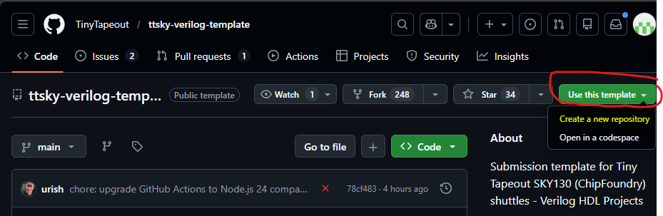

# Preparing for a Tiny Tapeout submission using a HDL template

This assumes that the submission is aimed at submitting a design for the [Tiny Tapeout TTSKY26A](https://app.tinytapeout.com/shuttles/ttsky26a)

A HDL design will make use of Verilog HDL. The template for the upcoming SKY26A run uses the [ttsky-verilog template](https://github.com/TinyTapeout/ttsky-verilog-template)

Before using the TT template, create a github account

## Create a github account

1. [Creating an account on GitHub](https://docs.github.com/en/get-started/start-your-journey/creating-an-account-on-github)
2. When signed into your github account, and clicking on the above template link, use the highligted button to create a repository in your own github account

3. Give the repository a meaningful name see e.g [naming repository according to top level HDL module](https://tinytapeout.com/hdl/important/)
4. You can now clone the repository to your local harddrive in your home folder, e.g. 

# Inspect the repository

Read the "README.MD" giving you instructions on how to use template.
There are som older videos by Matt Venn from Tiny Tapeout outling the use of the template, e.g [Tiny Tapeout 4 - working with an HDL][Tiny Tapeout 4 - working with an HDL](https://www.youtube.com/watch?v=KbWb6xd9jFE)
Key files and folders are e.g:

1. The "src" folder where source files (HDL files) in Verilog are located. Inspect the project.v, a finished TT submission will "instantiate" your design into project.v. Port names and definitions must not be changed.
2. info.yaml configures project information
3. The docs folder contains instruction on functionality of the design etc
4. You can see examples of how designs are instantiated in project.v and how documentation is made e.g (among many others) [867 : EZ Reservoir](https://github.com/kinako71-2/TTSKY25b)

# Using VHDL in creating a design for submission to TT

Tiny tapeout is using Verilog as its HDL language. In order to use VHDL, a design must be converted to Verilog. That is not different from a proprietary tool like Cadence which also needs VHDL converted to Verilog.
To convert VHDL to Verilog, we make use of a tool part of the Librelane installation, namely "Yosys" and the GHDL plugin for Yosys.

## Yosys GHDL plugin

The Yosys GHDL plugin and conversion from VHDL to Verilog is described here [Yosys GHDL plugin, synthesis](https://ghdl.github.io/ghdl/using/Synthesis.html#yosys-plugin)

### Usage, from VHDL to Verilog

yosys -m ghdl -p 'ghdl filename.vhdl -e top_unit [arch]; write_verilog filename.v'
for example:

```bash
yosys -m ghdl -p 'ghdl design.vhdl -e top_enity [arch]; write_verilog design.v'
```

*>[arch] is optional an refers to an entity with multiple architectures in VHDL.*

## Acessing Yosys from Librelane

Yosys is accessing directly from within a nix-shell
Assuming you are in the home folder of your linux installation.
Using the counter exanmple from the librelane documentation.Assuming to be in "/home/au173347/librelane":

```bash
cd librelane
nix-shell
yosys -m ghdl -p 'ghdl ../my_designs/counter.vhd -e counter; write_verilog counter.v'
```

The result is:

```verilog
module counter(clk_i, rst_ni, count_o);
  wire [7:0] _0_;
  wire [7:0] _1_;
  reg [7:0] _2_;
  input clk_i;
  wire clk_i;
  output [7:0] count_o;
  wire [7:0] count_o;
  wire [7:0] count_reg;
  input rst_ni;
  wire rst_ni;
  always @(posedge clk_i)
    _2_ <= _1_;
  assign _0_ = count_reg + 8'h01;
  assign _1_ = rst_ni ? 8'h00 : _0_;
  assign count_reg = _2_;
  assign count_o = count_reg;
endmodule
```
